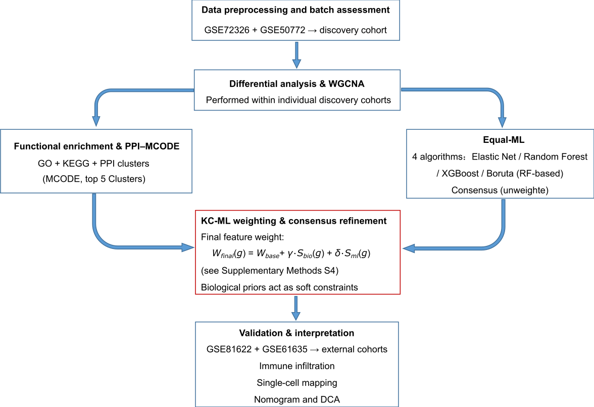
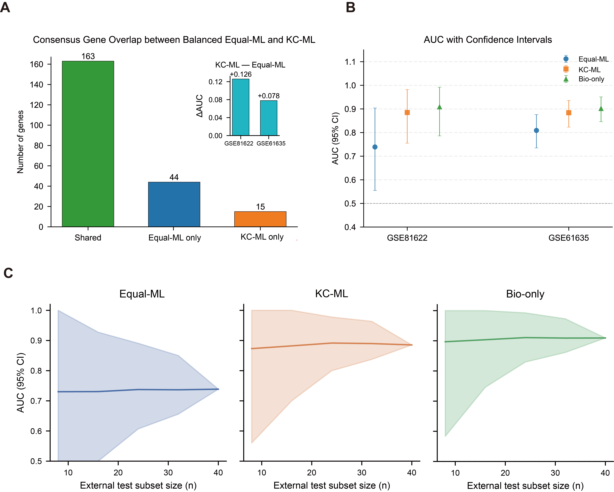

# Knowledge-Constrained Machine Learning (KC-ML)
<p align="center">
  
</p>

The **KC-ML framework** integrates biological priors (enrichment analysis and protein-protein interactions) as soft constraints into multi-model machine learning. This approach decouples biological knowledge from model architecture, improving feature stability and cross-cohort generalizability in high-dimensional transcriptomic prediction.

This repository provides the core implementation of the Equal-weight Machine Learning (Equal-ML) and Knowledge-Constrained Machine Learning (KC-ML) frameworks described in the accompanying paper. The code enables reproduction of the key methodological results related to feature weighting, multi-model consensus learning, and cross-cohort validation.

---

## 1. Environment setup
    ** Operating System:** The code was developed and tested on Windows 10/11. It is also compatible with Linux (e.g., Ubuntu 20.04) and macOS environments.
    ** Python Version:** Python 3.9
    ** Hardware:** Standard desktop computer (No GPU required for tabular data training).

A Conda environment is recommended for reproducibility.

```bash
conda create -n kc_ml python=3.9 -y
conda activate kc_ml
pip install pandas scikit-learn==1.3.2 xgboost==2.0.0 boruta==0.3 matplotlib==3.7.2 seaborn venn shap==0.42.1
pip install "numpy<1.24"
```

---

## 🚀 Key Features & Performance

**KC-ML enhances feature stability and robustness.** 
Unlike unweighted models that suffer from performance degradation in small sample sizes, KC-ML maintains high predictive accuracy and consensus stability.

<!-- 这里插入 Figure 6：展示硬核实力 -->
<p align="center">
  
</p>

*   **Panel A**: KC-ML improves consensus gene identification across cohorts.
*   **Panel B**: Superior AUC performance compared to Equal-ML approaches.
*   **Panel C**: Consistent robustness even with reduced training sample sizes (Ablation study).

---
## 2. Equal-weight machine learning (Equal-ML)

Equal-ML serves as a purely data-driven baseline in which all genes are treated as equally informative and no biological prior knowledge is applied.

```bash
cd equal_ml
python train_equal_ml.py
```

### Outputs

Results are written to the `results/` directory, including:
- Cross-model feature intersections (UpSet plots)
- Consensus gene ranking tables
- Model-specific performance metrics

### External validation (ROC analysis)

```bash
cd ROC
python AUC_nature.py
```

ROC curves and AUC values for the independent validation cohorts **GSE81622** and **GSE61635** are saved to the `external_validation_results_nature/` directory.

---

## 3. Knowledge-Constrained Machine Learning (KC-ML)

### Step 1: Biological feature weighting

```bash
cd weights
python weights.py
```

This step computes feature-level weights by integrating pathway enrichment and protein–protein interaction module evidence.  
The output file:

```
final_external_data_weights.csv
```

contains the final weights for all candidate genes.

Copy this file into the `kc_ml/` directory before proceeding.

---

### Step 2: KC-ML model training and evaluation

```bash
cd kc_ml
python kc_ml_training.py
```

### Outputs

Results are written to the `results_KC-ML/` directory, including:
- Knowledge-weighted multi-model feature consensus summaries
- Feature importance reports
- Internal validation performance metrics

### External validation (ROC analysis)

```bash
cd ROC
python AUC_nature.py
```

External validation results are saved to the `external_validation_results_nature/` directory.

---

## 4. Input data and reproducibility notes

- Input expression matrices should follow a **gene × sample** format, consistent with the manuscript.
- All transcriptomic datasets used in the study are publicly available from GEO under the accession numbers reported in the paper.
- Random seeds are fixed where applicable to ensure reproducibility.
- This repository is intended to reproduce the **core methodological conclusions** of the Equal-ML and KC-ML frameworks.

---

## 5. Scope of the repository

Included:
- Equal-weight machine learning (Equal-ML)
- Knowledge-constrained feature weighting
- KC-ML training and external validation

Not included:
- Nomogram construction
- Decision curve analysis (DCA)
- Figure-level plotting scripts for ablation or robustness analyses

These analyses are described in the manuscript and Supplementary Methods but are not required to reproduce the primary methodological findings.
